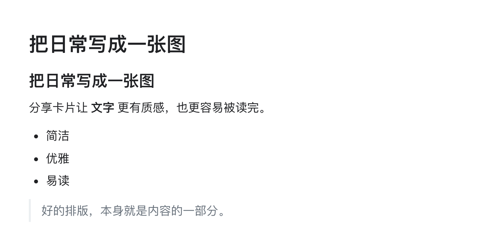
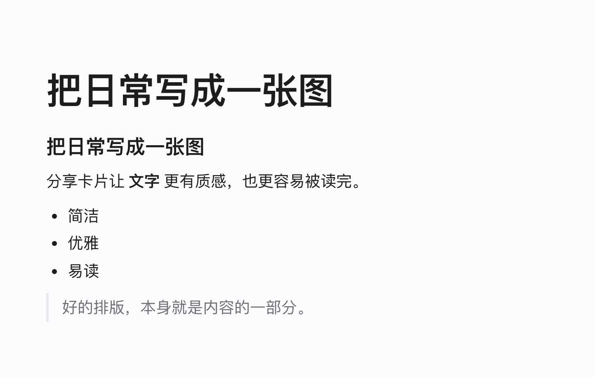
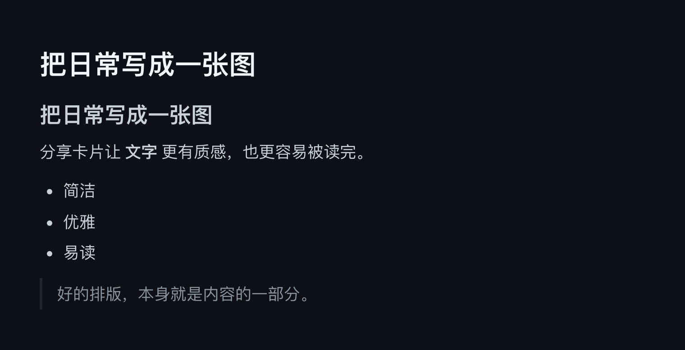
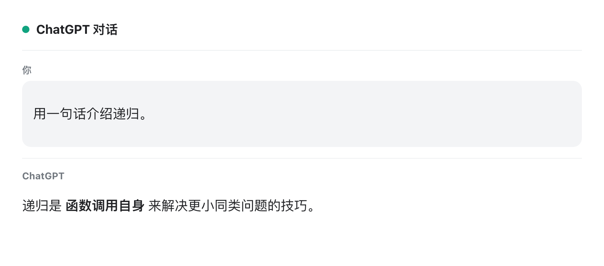

<div align="center">

# 分享图片生成器

把 ChatGPT 对话、网页文章或一段文字，排版成清晰、适合分享的卡片图片。

Node · TypeScript · Playwright · Express · Vite

[功能](#功能) · [风格样例](#风格样例) · [快速开始](#快速开始) · [API](#api) · [部署](#部署) · [隐私](#隐私与安全)

</div>

---

## 功能

- **三种内容来源**
  - **ChatGPT 链接**：粘贴公开分享链接 `https://chatgpt.com/s/t_<32 位小写十六进制>`，自动抽取对话。
  - **网页链接**：任意 `http(s)` 文章页，用**阅读模式**抽取正文（标题、段落、图片、列表）。
  - **输入文字**：直接输入文字，**支持 Markdown**（标题、列表、代码、加粗、链接、引用），最多 2000 字。
- **多种卡片风格**：流光卡片、简约白、苹果风、深色、杂志风、社交卡片，以及对话专用的“简洁对话”。
- **桌面 + 手机**：响应式双栏界面，PC 上左输入右预览，手机自动堆叠。
- **即时样例**：选风格时右侧直接显示该风格的真实样例。
- **可自定义署名**：默认 `powcai分享`，可改成任意来源署名。
- **不存储内容**：链接与文字只在本次请求内存中处理，响应不带缓存。

## 风格样例

每种风格都由真实模板渲染生成（重新生成：`pnpm generate:samples`）。

| 流光卡片 | 简约白 | 苹果风 |
|:---:|:---:|:---:|
|  |  |  |

| 深色 | 杂志风 | 社交卡片 |
|:---:|:---:|:---:|
|  |  |  |

ChatGPT 对话另有 **简洁对话** 风格：



## 快速开始

### 环境要求

- Node.js **22.13.0** 或更高（见 [`.node-version`](.node-version)）
- pnpm **10.15.0**（随 Node 自带的 Corepack 即可启用）

### 安装与本地运行

```bash
pnpm install --frozen-lockfile
pnpm exec playwright install chromium   # 安装截图用的 Chromium
pnpm dev
```

打开 <http://127.0.0.1:4173>。

要让同一可信局域网内的设备（如手机）访问：

```bash
HOST=0.0.0.0 pnpm dev
```

> 该模式监听所有网络接口，仅限可信局域网使用。

### 常用脚本

| 命令 | 作用 |
| --- | --- |
| `pnpm dev` | 本地开发（热重载） |
| `pnpm build` | 构建生产产物（前端 `dist/web` + 服务端 `dist/server`） |
| `pnpm start` | 运行生产构建 |
| `pnpm verify` | lint + typecheck + 单元/集成测试 + 构建 + 生产 E2E |
| `pnpm test` | 单元 + 集成测试 |
| `pnpm test:e2e` | Playwright 浏览器 E2E |
| `pnpm tsx scripts/smoke-render.ts` | 合成数据跑通全部渲染链路（无网络依赖） |
| `pnpm generate:samples` | 重新生成风格样例图 |
| `pnpm package:source` | 打包可迁移的源码压缩包 |

健康检查：`GET /api/health` → `{"status":"ok"}`。

## API

`POST /api/render`，请求体为 JSON，成功返回 `image/png`。

```jsonc
// ChatGPT 链接
{ "source": "chatgpt-share", "url": "https://chatgpt.com/s/t_...", "style": "conversation-clean", "byline": "powcai分享" }

// 网页链接（阅读模式）
{ "source": "web-link", "url": "https://example.com/article", "style": "article-liuguang" }

// 纯文字（支持 Markdown）
{ "source": "plain-text", "text": "# 标题\n正文", "style": "article-apple" }

// 兼容旧版：自动识别 ChatGPT 链接或普通网页
{ "url": "https://..." }
```

**字段**

| 字段 | 说明 |
| --- | --- |
| `source` | `chatgpt-share` / `web-link` / `plain-text` |
| `url` | ChatGPT 分享链接或任意 `http(s)` 文章页 |
| `text` | 纯文字（Markdown），≤ 2000 个 Unicode 字符 |
| `style` | 可选，见下表；不传用对应来源的默认风格 |
| `byline` | 可选，图片底部署名，≤ 50 字 |

**风格 ID**

| 来源 | 可选风格 |
| --- | --- |
| `chatgpt-share` | `conversation-clean`（简洁对话） |
| `web-link` / `plain-text` | `article-liuguang`（流光卡片，默认）、`article-clean`、`article-apple`、`article-dark`、`article-magazine`、`article-social` |

**错误码**

| HTTP | `error` | 含义 |
| --- | --- | --- |
| 400 | `unsupported_share_url` / `unsupported_url` | 链接不被接受 |
| 400 | `invalid_text` / `text_too_long` | 文字为空或超长 |
| 400 | `unsupported_style` / `invalid_request` | 风格或请求格式不合法 |
| 413 | — | 请求体过大（> 16 KB） |
| 422 | `conversation_not_found` / `article_not_found` | 页面无法抽取对话/正文 |
| 502 | `browser_unavailable` | 浏览器渲染失败 |

## 部署

本项目是一个常驻 Node + Chromium 进程，可一键部署到任何支持 Docker 的平台。

### Render（推荐）

仓库已含 [`render.yaml`](render.yaml) Blueprint：

1. 在 Render 选择 **New → Blueprint**，连接本仓库。
2. 自动创建 Web Service（Docker 运行时，含 Chromium）。
3. 推送到部署分支即自动重新构建上线。

> 免费层 512MB 且会休眠；Chromium 截图较吃内存，正式使用建议升到 starter（2GB、常驻）。

### 通用 Docker

```bash
docker build -t share-image .
docker run -p 4173:4173 -e PORT=4173 share-image
```

镜像基于 `node:22-slim`，构建时已用 `playwright install --with-deps chromium` 装好浏览器与系统依赖。

### 环境变量

| 变量 | 默认 | 说明 |
| --- | --- | --- |
| `HOST` | `127.0.0.1` | 监听地址；部署时设为 `0.0.0.0` |
| `PORT` | `4173` | 监听端口（Render 会自动注入 `PORT`） |
| `NODE_ENV` | — | 设为 `production` 走生产模式 |

> 关于“Node 应用前置 Cloudflare / 边缘限流”的后续方案见 [`docs/cloudflare-deployment.md`](docs/cloudflare-deployment.md)。

## 隐私与安全

- 不建立账号、不存历史；链接与文字只在当前请求内存中处理，输出 PNG 后即丢弃。
- ChatGPT / 网页 HTML、Markdown 输出都会经过阅读白名单**净化**：移除脚本、事件属性、表单和危险协议。
- 所有 API 与图片响应都设置 `Cache-Control: no-store`。
- 网页链接由服务端发起抓取；公网部署建议在边缘做速率限制或用 Cloudflare Access 限定访问，详见 [`docs/privacy-security.md`](docs/privacy-security.md)。

## 项目结构

```text
src/
├── server/          # Express 应用、渲染管线、模板、净化、阅读模式、Markdown
│   ├── app.ts
│   ├── render.ts
│   ├── template.ts
│   ├── sanitize.ts
│   ├── readability.ts
│   ├── markdown.ts
│   └── platforms/   # ChatGPT 适配与平台注册
├── shared/          # 前后端共享的请求/风格类型
└── web/             # 原生 DOM 前端 + 风格样例
docs/                # 状态、隐私、部署说明
scripts/             # 样例生成、合成 smoke、源码打包
test/                # 单元 / 集成 / E2E
```

## 贡献

欢迎提 Issue 或 Pull Request。提交前请跑 `pnpm verify`；新增或修改卡片风格后用 `pnpm generate:samples` 更新样例图。

## 路线图

- 继续打磨各模板在长文/长对话下的排版；
- 用真实页面持续校准抽取与净化；
- 可选二维码、多平台比例等增强。

更多状态见 [`docs/status-and-roadmap.md`](docs/status-and-roadmap.md)。

## 许可证

[MIT](LICENSE)
